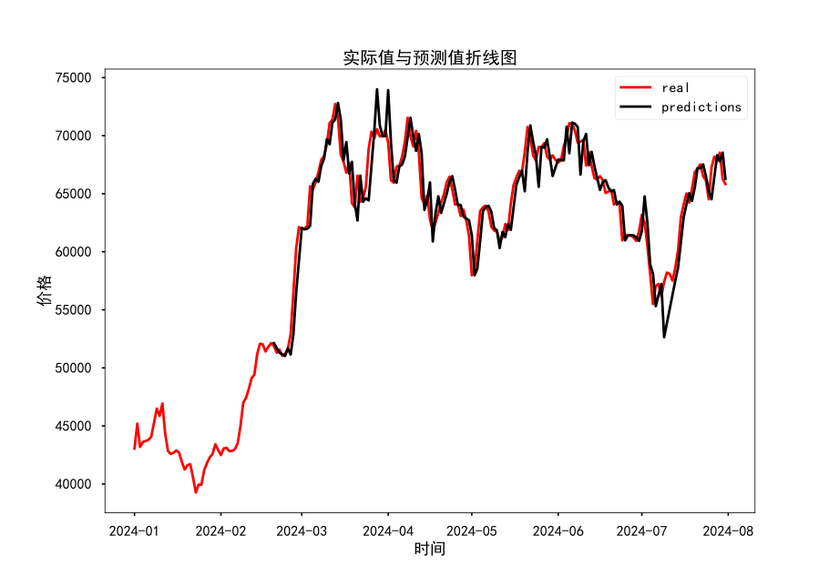

# Introduction
This programe aims to build a predictive model of BTC price based on classic time series analysis model ARIMA. And the built model is parameter-free i.e. the model modifies itself as the time windows goes forward using datas of BTC's 1-day kline datas from Bianance.
# Data Pre-processing
Calculated the average price of each day.
# Peremeters Picking
To determine the $d$ in ARIMA($p$, $d$, $q$), I calculate the d difference and do the Fuller test to see if the resulting series is stationary. Then $p$ and $q$ in ARIMA($p$, $d$, $q$) is determined through minimizing BIC.
# Model Fitting
Fit the model using the last 50 days's average price.
# Prediction
Output the predicted price of the next first day.
# Filtering
Abnormal values occured due to sigularity of the covariance matrix. Filter these values by setting a range of $[10000, 100000]$ 
# Result

# Conclusion
The result is not much satisfactory due to calculation error and the model itself. Often than not, the fitted model does not have either AR part or MA part. But in the begining, the result is relatively more sensible.
